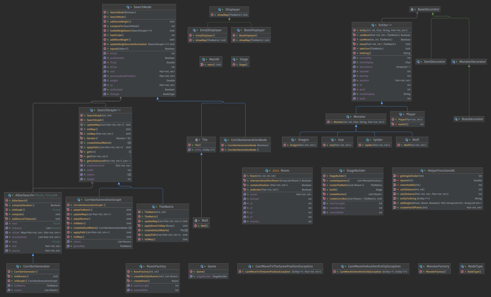

# RoguEngine

This is some kind of school project, more information incoming...

TOC :
- [Usage](#usage)
- [Version](#versions)
- [UML](#uml)
- [Dependencies and Algorithms](#dependencies-and-algorithms)
  - [Dependencies](#dependencies)
  - [Algorithms](#algorithms)

## Usage

You can run tests using the following command at the root of this project, as long 
as you are having at least JDK 8 :

```shell
./gradlew test
```

You can run the project using :

```shell
# Still to determine...
```

## Versions

Current state is kinda awful, a lot of refactoring is needed as the first version
that I had was actually pretty awful POO-wise.

~~The first version should be ready for `2022/02/20` !~~  
It should contain everything related to the algorithmic...

I currently have :
- Working map generation
- A first work on the StageBuilder

I still lack :
- The entity AI (Should not take to long as A* is implemented)
- The room discovering
- A lot of tests

The commit history is currently a mess as I failed to do things one at a time... :#

---

The second version should be ready for the end of the project :

It should contain everything related to the UI.


## UML

You can take a look at the UML right here :



Here's an UML of what's currently (at least partially) implemented :


Both images are available with a better resolution respectively
[here for the prototype](./doc/images/uml-kotlin-prototype.png) 
and [here for the 'currently implemented'](./doc/images/uml-currently-implemented.png).

## Dependencies and Algorithms

#### Dependencies

Dependencies added :
- [MockK](https://mockk.io/) 
> This is a dependency used for the TDD part allowing us to mock data more easily

---

#### Algorithms

Known algorithms used :
- [A*](https://en.wikipedia.org/wiki/A*_search_algorithm)
> Getting the shortest path to create the corridors
- [LPA*](https://en.wikipedia.org/wiki/Lifelong_Planning_A*) (Not yet implemented)
> Getting the shortest path for every unit on the map

--- 


