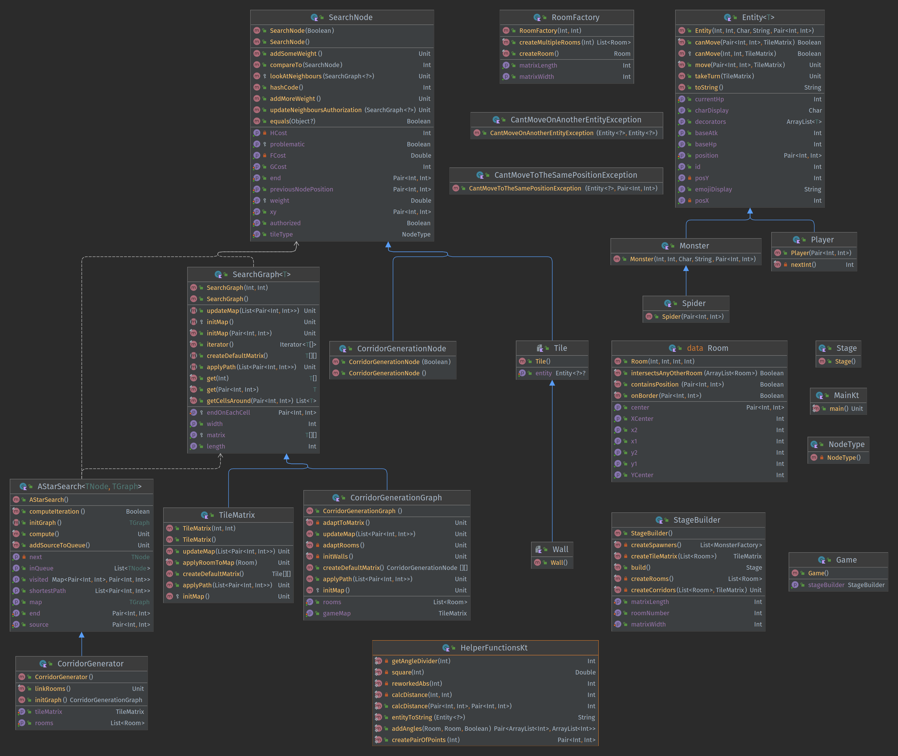

# RoguEngine

This is some kind of school project, more information incoming...

You can take a look at the UML right here :

Here's an UML of what's currently (at least partially) implemented :

Dependencies added :
- MockK 
> This is a dependency used for the TDD part allowing us to mock data more easily

---

Known algorithms used :
- [A*](https://en.wikipedia.org/wiki/A*_search_algorithm)
> Getting the shortest path to create the corridors
- [LPA*](https://en.wikipedia.org/wiki/Lifelong_Planning_A*) (Not yet implemented)
> Getting the shortest path for every unit on the map
