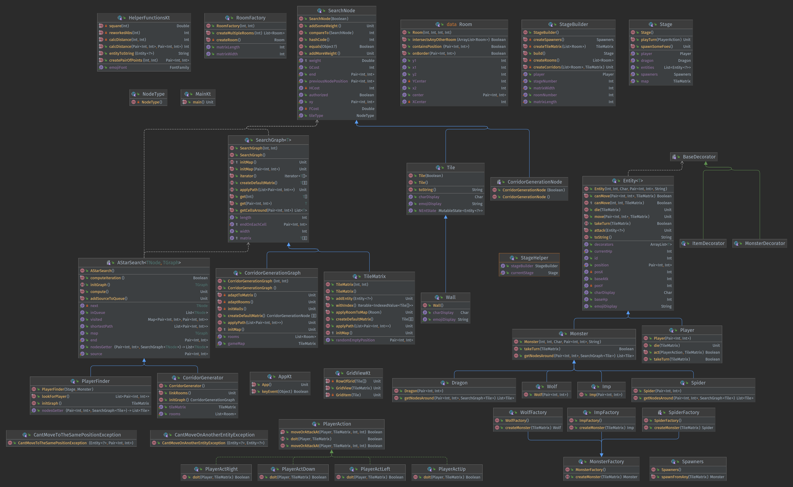
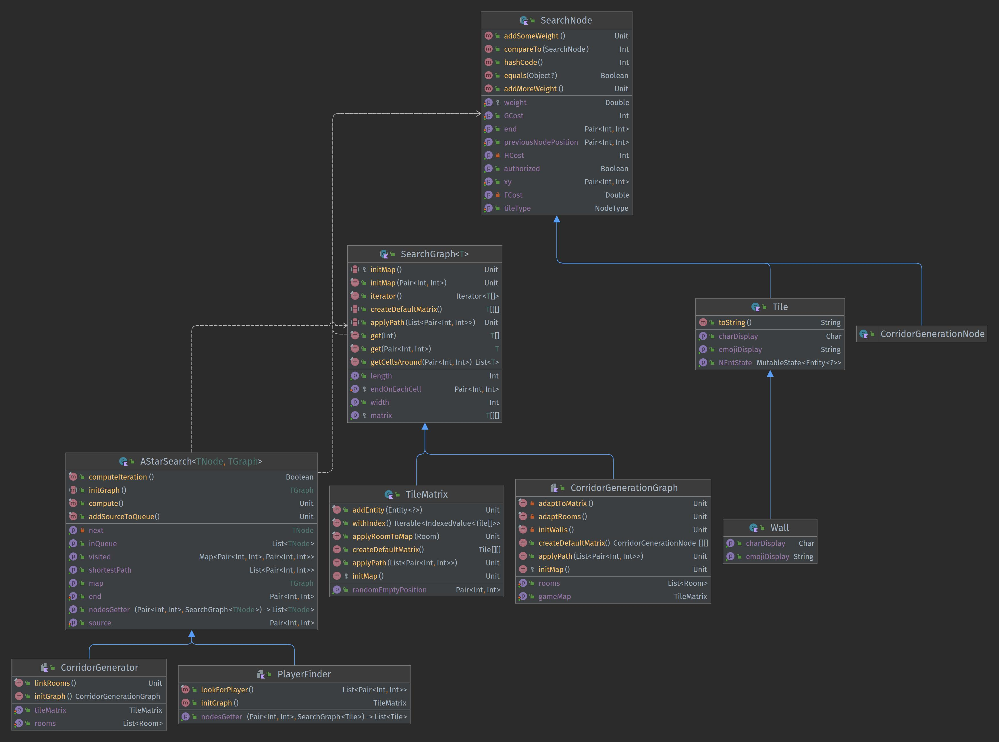

# Rapport Projet S6

TOC :
- [RoguEngine](#roguengine)
  - [Préambule](#prambule)
  - [Contenu](#contenu)
  - [Difficultés](#difficults)
  - [État actuel et améliorations possibles](#tat-actuel-et-amliorations-possibles)
- [A*](#a)
  - [Historique](#historique)
  - [Implémentation](#implmentation)
  - [Utilisation dans le projet](#utilisation-dans-le-projet)

## RoguEngine

### Préambule

Ce projet était un projet me tenant vraiment à cœur, [j'avais déjà par le passé essayé 
de me pencher dessus en Java](https://github.com/HFDrae/RogueLike), mais je manquais
encore beaucoup de connaissances pour pouvoir le réaliser correctement... Au point 
où à l'époque, j'avais abandonné le projet à cause de mon manque de connaissance 
sur les entrées clavier en Java.

J'ai donc eu envie pour voir mon avancée de me relancer sur ce projet qui me trainait
toujours dans un coin de la tête.  
Le choix du langage est, je pense assez important à noter, au début, j'aurais voulu me
pencher sur ce projet en [Rust](https://www.rust-lang.org/), mais l'UE demandant d'utiliser les technologies objet,
Rust n'était pas un choix adéquat donc je me suis plutôt tourné vers C++ ou Kotlin. Mes 
connaissances en C++ s'arrêtant au C, il devenait compliqué d'apprendre C++ en même que
de se lancer sur un projet de cette envergure, je serais assez souvent revenu en arrière 
pour reprendre mes différentes méthodes ou la construction de mes classes au fur et à 
mesures de mon apprentissage, j'ai donc préféré me concentrer sur un langage que je connais
beaucoup mieux : Kotlin !

On m'a souvent demandé pourquoi utiliser Kotlin plutôt que Java ou Python pour un projet de 
ce type, la réponse est simple : Python était peu agréable pour un projet de cette envergure 
et Java trop scolaire, on pourrait aussi noter des avantages de Kotlin par rapport à Java ou 
Python en vrac :
- [Null Safety](https://kotlinlang.org/docs/null-safety.html) 
- [Langage Fonctionnel](https://kotlinlang.org/docs/functions.html) (en plus d'orienté objet)
- Possibilité de [viser la JVM (`Java Virtual Machine`)](https://kotlinlang.org/lp/server-side/) mais aussi le
[Web](https://kotlinlang.org/docs/js-overview.html) (voir les difficultés) ou [Android](https://kotlinlang.org/docs/android-overview.html)


### Contenu

Ce projet étant un projet de cours, il respecte certaines directives :
- Documentation
- Utilisation de l'orienté objet (Classes, polymorphisme, patrons de conceptions)
- TDD

#### Documentation

Chaque classe et chaque méthode publique et protégée ont leur KDoc associée, il devrait
être simple pour un autre développeur de pouvoir faire des ajouts ou modifications en
utilisant ce qui est déjà présent sur le projet. Ce rapport et le [README](../README.md)
présent à la racine du projet viennent compléter la documentation.

#### COO

Dans ce projet j'ai fait une assez forte utilisation des technologies orientées objets 
qui se ressent dans l'implémentation de `A*` ou au nombre de patrons de conceptions présents,
on peut retrouver par exemple un [`Builder`](../src/main/kotlin/util/factories/StageBuilder.kt),
des `Factories` ou même une `AbstractFactory` (voir
[MonsterFactory](../src/main/kotlin/util/factories/MonsterFactory.kt)).

#### TDD

Une batterie de tests est aussi présente, ont été écrits les tests pour :
- Les différentes entités (déplacements)
- A* (ainsi que ce qui est lié à la génération de couloirs)

#### Allez plus loin

Dans ce projet, je ne me suis pas simplement arrêté aux directives demandées, j'ai par exemple 
inclus des dépendances pour la gestion des `Mock`s (maquettes d'objets) ou la gestion de l'UI.


### Difficultés

J'ai pu dans ce projet faire fasse à de nombreuses difficultés telles que :

- La gestion de A* de façon générique
- La gestion du temps 
- La gestion des évènements clavier dans la JVM

Par rapport au dernier point, la JVM ne permet pas de gérer "crument" les évènements provenant
du clavier, ce qui pour un projet utilisant le clavier pour par exemple, les déplacements, peut
poser d'assez gros problèmes, la solution la plus simple à mettre en œuvre, mais aussi la plus
contraignante pour l'utilisateur est de changer le mode de lecture du terminal afin de ne pas 
avoir à appuyer sur la touche `Entrée` pour récupérer l'évènement. On aurait pu pour éviter à 
l'utilisateur de changer le mode du terminal utiliser une solution à base de conteneurs telle que Docker, mais ça 
demandait à l'utilisateur d'installer beaucoup de choses... Ce qui n'est pas forcément une 
décision viable pour un produit. Les deux autres solutions qui étaient possibles étaient :
- Passer par un client web
- Passer par une interface graphique

Le client web aurait pu être une bonne idée, surtout que Kotlin a la possibilité d'être transpilé
en JavaScript, mais ça demandait soit de reprendre une grosse partie du projet pour adopter
une architecture client-serveur utilisant par exemple des sockets (ce qui aurait été faisable 
simplement en JavaScript avec Socket.io) ou de reprendre une grosse partie du code pour que le
passage en Kotlin/JS se passe sans problème (ce qui n'est pas forcément une bonne idée à 3 
semaines du rendu).  
Par élimination (et après un bref essai de l'architecture client-serveur), il restait le
passage à l'interface graphique, avec plus de temps, on aurait par exemple pu essayer d'utiliser 
[LWJGL](https://www.lwjgl.org/) (la librairie utilisée pour des jeux tels que Minecraft pour ne
citer que celui ci). En recherchant un peu ce qui était utilisable, il ne restait que JavaFX, 
Swing et Compose-Desktop, ce dernier étant conçu en Kotlin pour Kotlin, autant partir dessus.

> Il est *à mon sens* intéressant de noter que Compose-Desktop a une compatibilité avec LWJGL !
> > Compose a aussi permis de simplifier la tâche étant donné qu'avec ce framework, on a
> > la possibilité de construire l'UI avec des composants (tels que des images par exemple)
> > ou de choisir explicitement la police...  
> > On peut aussi noter que Compose permet de gagner en performances puisque l'on ne va pas
> > mettre à jour toute l'interface, mais seulement les composants qui ont besoin de l'être, 
> > ici certaines cases de notre matrice d'affichage par exemple.

### État actuel et améliorations possibles

#### État actuel 

Ce projet contient donc :
- Une interface minimaliste avec `Compose`, les entités sont affichées avec des emojis pour plus
de clarté
- Une gestion des déplacements et attaques du joueur avec les touches de déplacement du clavier
- La génération d'un étage
- Une génération complète de la carte avec l'algorithme `A*`
- Une gestion des déplacements des ennemis toujours grâce à `A*`
- Une génération automatique des ennemis

Voici l'UML complet du projet :



#### Améliorations

On pourrait encore l'améliorer en :
- Ajoutant :
  - une sorte de "brouillard de guerre" qui disparaitrait progressivement selon les déplacements 
  du joueur
  - la possibilité de jouer sur plusieurs étages
  - les stats du joueur
  - une "vraie" intelligence aux ennemis, pas seulement dans les déplacements
    - On pourrait par exemple leur donner plusieurs attaques ou le choix de s'éloigner du joueur pour se repositionner
  - des objets qui permettraient par exemple :
    - de se soigner
    - de faire plus de dégâts
    - d'avoir plus de points de vie
    - d'avoir des sorts
> Ce point est d'ailleurs la raison de la présence des `Decorator`s qui sont d'ailleurs comme on
> peut le voir présent tout au long du projet étant donné que la classe `Entity` avait dans sa 
> généricité un type de Décorateurs donné.
> ```kotlin
> abstract class Entity<T:BaseDecorator?>/*<-le générique de décorateur*/( /*...*/ ) { /*...*/ }
> ```
- Modifiant :
  - la classe [`PlayerFinder`](../src/main/kotlin/util/graph/algo/PlayerFinder.kt) pour qu'elle implémente `LPA*` plutôt que `A*`
  - la génération des ennemis, on pourrait par exemple imaginer qu'une araignée mette 1 tour à apparaitre et un dragon 15 ou 20
  - l'interface pour utiliser des sprites plutôt que des glyphes 

Un dernier type d'amélioration pourrait être, si je devais essayer de refaire ce projet (pas
dans le cadre de cet UE), de me concentrer sur les performances plutôt que simplement la 
compatibilité et la "simplicité à coder" et de partir complètement sur C++ ou Rust.


## A*

Pour réaliser ce projet, j'avais besoin d'un moyen de connecter les salles avec des couloirs.
La première tentative pour ce faire était de partir du centre d'une salle et aller au centre
d'une autre d'abord horizontalement puis verticalement (ou l'inverse). Cette implémentation 
aurait pu suffire et était de complexité 'parfaite' (`O(x)` où `x` correspond à la somme du
nombre d'éléments sur l'axe horizontal et sur l'axe vertical entre le centre de deux salles),
mais ça aurait été peu intéressant pour le joueur de toujours avoir des couloirs assez 
rectilignes.

Par chance, en L3 nous avons étudié la théorie des graphes et nous avons pu travailler sur des
algorithmes de recherche du plus court chemin tels que [Dijkstra](https://en.wikipedia.org/wiki/Dijkstra%27s_algorithm).
Dijkstra était un algorithme qui était fortement à considérer parce qu'il permettait de trouver 
le plus court chemin entre deux salles en permettant de faire des angles plus intéressant qu'un 
simple tournant. Je me suis aussi assez fortement intéressé aux algorithmes de recherches par vagues 
qui permettent de trouver à coup sûr le plus court chemin possible, mais à un coût assez élevé
puisque l'on va explorer le graphe entier (lors de mes recherches, je suis par exemple passé 
par cette vidéo qui explique assez bien l'algorithme que j'aurais implémenté : 
[https://www.youtube.com/watch?v=0ihciMKlcP8](https://www.youtube.com/watch?v=0ihciMKlcP8)).   
À force d'approfondir mes recherches, j'ai trouvé un algorithme qui correspondait à la tâche
et qui est souvent utilisé pour ce type de traitement dans les jeux de ce type, le dénommé 
**__`A*`__** !

### Historique

A* ou A-star (en français A-étoile) est donc un algorithme de recherche dans un graphe.
Il a été publié pour la première fois en 1968 par Peter Hart, Nils Nilsson et Bertram
Raphael de l'Institut de Recherche de Stanford ([SRI International](https://en.wikipedia.org/wiki/SRI_International))
et est basé sur l'algorithme de Dijkstra. Cet algorithme a vu le jour au cours du 
projet `Shakey the Robot` qui correspond plus ou moins au début de l'Intelligence 
Artificielle et de la Data Science de par les domaines ciblés par celui ci (Vision par 
ordinateur et Traitement Automatique des Langues). On doit par exemple à ce projet des
avancées telles que la transformation de Hough, qui agit sur le traitement des images.

La proposition originale (de Nilsson) dans ce projet était d'utiliser une simple fonction heuristique 
estimant la distance entre le point de départ et le point d'arrivée pour en récupérer le 
chemin, Raphael a proposé de se servir en plus de cette heuristique de la distance entre 
la source et le point actuel en plus de cette heuristique ce qui donnait la formule suivante : 

  

> Où `g(n)` correspond à la distance entre le nœud `n` et la source et `h(n)` son heuristique.  
> Quand `h(n)` vaut 0, on retrouve l'algorithme de Dijkstra.

À ce jour, cet algorithme est utilisé pour faire de la recherche de chemins les plus courts 
dans des jeux, certains GPS, en robotique et sert aussi parfois en NLP ('Natural Language Processing' 
ou 'Traitement Automatique des Langues' en français) à la place de l'algorithme de Viterbi par exemple.

---

La complexité de cet algorithme dépend assez fortement de son heuristique, dans les pires cas, 
sa complexité pourra être :


> Où `b` représente le nombre de nouveaux nœuds accessibles par branches et `d` la profondeur jusqu'à laquelle on va.

Dans les cas où son heuristique sera la meilleure, on arrive à la formule suivante :


> où `h(n)` représente l'heuristique actuelle et `h*(n)` le coût de la meilleure heuristique.

---

Il existe d'autres algorithmes qui dérivent de A* tels que [LPA* (Lifelong Planning A*)](https://en.wikipedia.org/wiki/Lifelong_Planning_A*), [D*](https://en.wikipedia.org/wiki/D*), [SMA* (Simplified Memory Bound A*)](https://en.wikipedia.org/wiki/SMA*) ou [IDA* (Iterative Deepening A*)](https://en.wikipedia.org/wiki/Iterative_deepening_A*)

### Implémentation

L'algorithme A* ressemble à ceci en pseudo-code :

```
// Source : Wikipedia
function reconstruct_path(cameFrom, current)
    total_path := {current}
    while current in cameFrom.Keys:
        current := cameFrom[current]
        total_path.prepend(current)
    return total_path

// A* finds a path from start to goal.
// h is the heuristic function. h(n) estimates the cost to reach goal from node n.
function A_Star(start, goal, h)
    // The set of discovered nodes that may need to be (re-)expanded.
    // Initially, only the start node is known.
    // This is usually implemented as a min-heap or priority queue rather than a hash-set.
    openSet := {start}

    // For node n, cameFrom[n] is the node immediately preceding it on the cheapest path from start
    // to n currently known.
    cameFrom := an empty map

    // For node n, gScore[n] is the cost of the cheapest path from start to n currently known.
    gScore := map with default value of Infinity
    gScore[start] := 0

    // For node n, fScore[n] := gScore[n] + h(n). fScore[n] represents our current best guess as to
    // how short a path from start to finish can be if it goes through n.
    fScore := map with default value of Infinity
    fScore[start] := h(start)

    while openSet is not empty
        // This operation can occur in O(Log(N)) time if openSet is a min-heap or a priority queue
        current := the node in openSet having the lowest fScore[] value
        if current = goal
            return reconstruct_path(cameFrom, current)

        openSet.Remove(current)
        for each neighbor of current
            // d(current,neighbor) is the weight of the edge from current to neighbor
            // tentative_gScore is the distance from start to the neighbor through current
            tentative_gScore := gScore[current] + d(current, neighbor)
            if tentative_gScore < gScore[neighbor]
                // This path to neighbor is better than any previous one. Record it!
                cameFrom[neighbor] := current
                gScore[neighbor] := tentative_gScore
                fScore[neighbor] := tentative_gScore + h(neighbor)
                if neighbor not in openSet
                    openSet.add(neighbor)

    // Open set is empty but goal was never reached
    return failure
```

### Utilisation dans le projet

On peut retrouver l'implémentation de cet algorithme dans ce projet dans la classe [AStarSearch](../src/main/kotlin/util/graph/algo/AStarSearch.kt). 
Le plus grand défi lors de la réalisation de cet algorithme aura été de le rendre générique 
afin de l'utiliser dans plusieurs cas, ici la création des couloirs et la recherche du joueur
par les entités.

Cette généricité passe du type de nœuds que va contenir le graphe jusqu'à la fonction
permettant de récupérer les nœuds autour du nœud courant :

```kotlin
// Les nœuds doivent forcément étendre la classe SearchNode, le graphe un SearchGraph
abstract class AStarSearch<TNode: SearchNode, TGraph: SearchGraph<TNode>> {
  /* ... */
  open val nodesGetter: NodesGetter<TNode> = { xy, map -> map.getCellsAround(xy) }
  /* ... */
}
```

> On peut noter que le NodesGetter utilise le sucre syntaxique de Kotlin permettant de 
> faire des '`typedef`' pour des fonctions comme on pourrait le faire en Haskell :
> ```kotlin
> typealias NodesGetter<T> = (Pair<Int, Int>, SearchGraph<T>) -> List<T>
> ```
> Ici, notre fonction aura comme paramètres une paire d'entier ainsi qu'un SearchGraph 
> et renverra une liste contenant des éléments de type `T`. Cette généricité jusque dans 
> la fonction permettant de récupérer les nœuds permet de simplifier le fait d'avoir
> plusieurs types de déplacements différents pour une Entité donnée. 

Voici l'UML correspondant à l'implémentation de A* :



## Sources

### Roguelike

- Kotlinlang
  - https://kotlinlang.org/docs/null-safety.html
  - https://kotlinlang.org/docs/functions.html
  - https://kotlinlang.org/lp/server-side/
  - https://kotlinlang.org/docs/js-overview.html
  - https://kotlinlang.org/docs/android-overview.html
- https://www.lwjgl.org/
### A*

- https://theory.stanford.edu/~amitp/GameProgramming/AStarComparison.html
- https://brilliant.org/wiki/a-star-search/
- https://iq.opengenus.org/a-search/
- https://www.mygreatlearning.com/blog/a-search-algorithm-in-artificial-intelligence/
- Wikipedia
  - https://en.wikipedia.org/wiki/SRI_International
  - https://en.wikipedia.org/wiki/Dijkstra%27s_algorithm
  - https://en.wikipedia.org/wiki/A*_search_algorithm
  - https://en.wikipedia.org/wiki/Shakey_the_robot
  - https://en.wikipedia.org/wiki/Lifelong_Planning_A*
  - https://en.wikipedia.org/wiki/D*
  - https://en.wikipedia.org/wiki/SMA*
  - https://en.wikipedia.org/wiki/Iterative_deepening_A*
- Youtube
  - https://www.youtube.com/watch?v=-L-WgKMFuhE
  - https://www.youtube.com/watch?v=eSOJ3ARN5FM
  - https://www.youtube.com/watch?v=0ihciMKlcP8